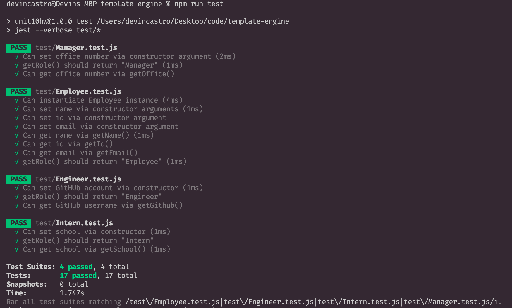
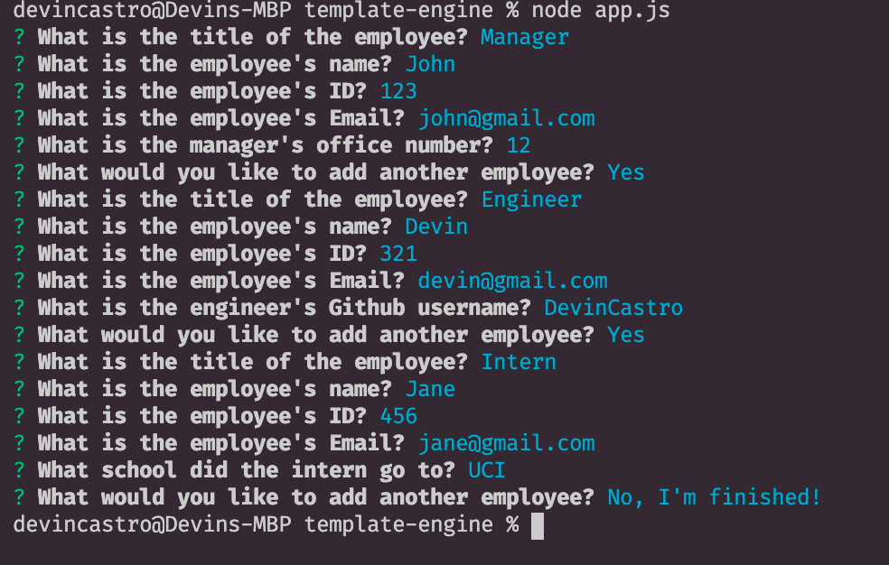
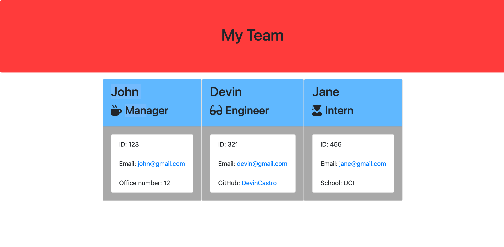

# template-engine

Link to Video: https://www.youtube.com/watch?v=32dVDKkq2xY

## Description:
> This application takes in user input in the console to generate a html page that displays a team of employees in flush and organized fashion.  The program will allow the user to input as many employees as they want.

### Usage: 
To use this application, first install the proper npm's by opening up the terminal and using the command, 'npm i'.  Next run the program by typing in the terminal the command, 'node ass.js'.  The console will then prompt you, the user, to enter in the following information.  Enter the information for as many employees as you would like and when you are, select that you are finished.  The program will render a 'team.html' page in the output folder. This will be the fully rendered template will all of the information you entered!

### All tests pass:

### Example of prompts and user inputs:

### Example of newly generated team member HTML page:
